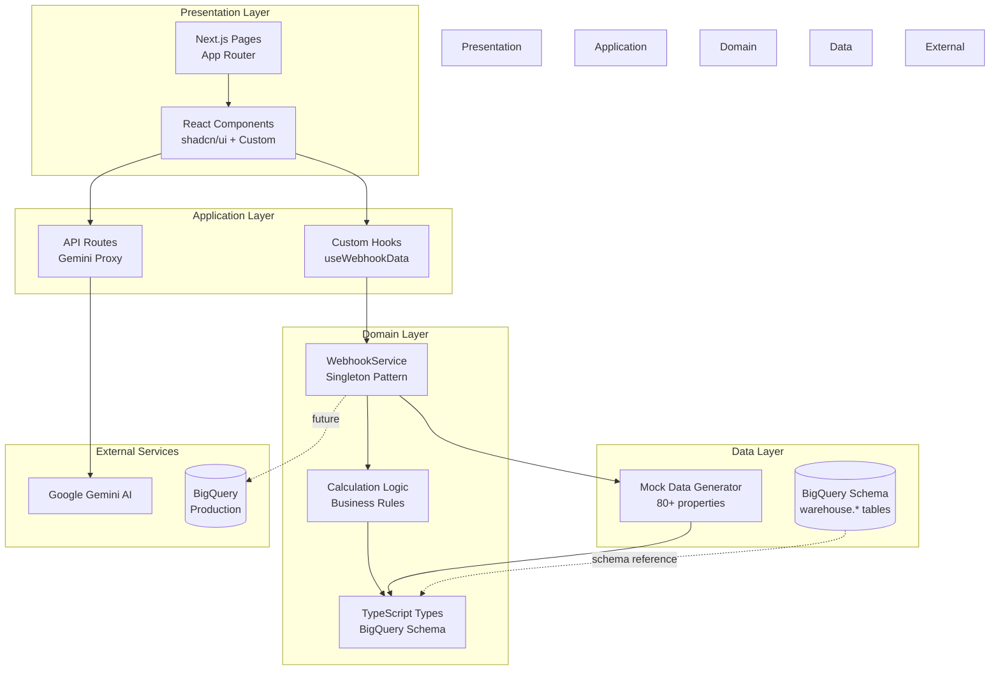
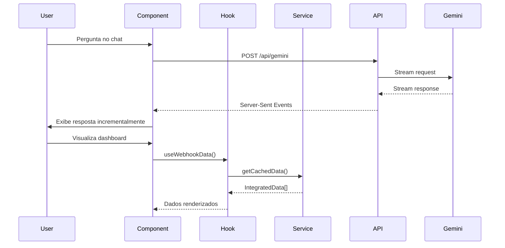
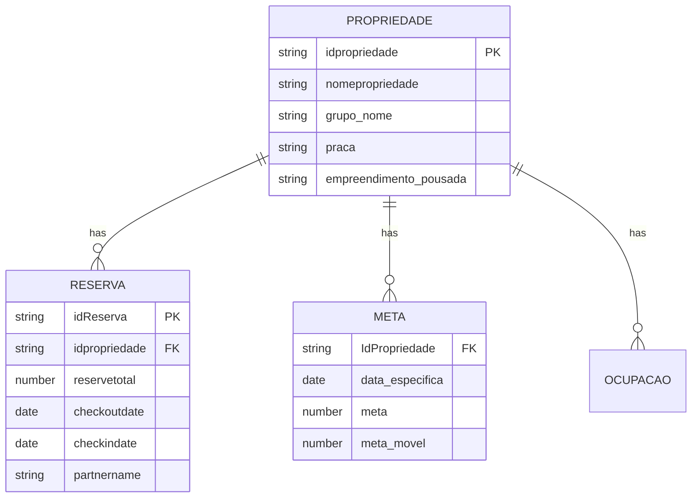
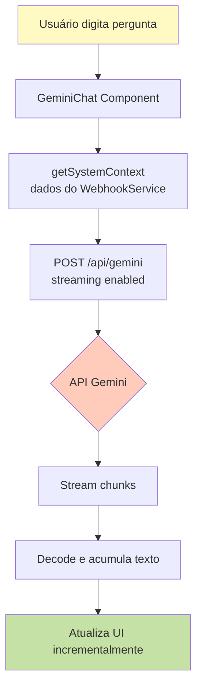
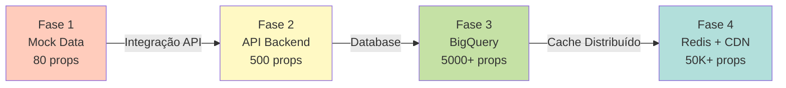

# ARCHITECTURE.md - Arquitetura Técnica

## 📐 Visão Geral Arquitetural

### Padrão Arquitetural: **Layered Architecture com Data-Driven Design**

O sistema segue uma arquitetura em camadas inspirada em **Clean Architecture** e **Domain-Driven Design**, otimizada para um dashboard de BI com foco em visualização de dados e análises preditivas.



---

## 🏛️ Camadas da Arquitetura

### 1. **Presentation Layer** (Camada de Apresentação)

**Responsabilidade**: Renderização de UI, interação do usuário, e apresentação de dados.

#### Componentes Principais

- **Pages** (`/app`): Rotas do Next.js App Router
  - Server Components para SSR/SSG
  - Client Components para interatividade
- **UI Components** (`/components/ui`): Componentes base do shadcn/ui
- **Business Components** (`/components`): Componentes de domínio
  - `KeyMetricsPanel`: Exibe KPIs principais
  - `GeminiChat`: Interface do co-piloto de IA
  - `AnalyticsCharts`: Visualizações de dados

#### Padrões Utilizados

- **Composition Pattern**: Componentes compostos e reutilizáveis
- **Container/Presenter**: Separação de lógica e apresentação
- **Render Props**: Para componentes altamente configuráveis

---

### 2. **Application Layer** (Camada de Aplicação)

**Responsabilidade**: Orquestração de casos de uso, comunicação com APIs, e gerenciamento de estado.

#### Elementos Principais

- **API Routes** (`/app/api`):
  - `GET /api/gemini` - Proxy streaming para Google Gemini
  - Autenticação via `GEMINI_API_KEY` (server-side)
  
- **Custom Hooks** (`/hooks`):
  - `useWebhookSync`: Gerencia sincronização de dados
  - `useFilters`: Gerencia estado de filtros globais

#### Comunicação de Dados



---

### 3. **Domain Layer** (Camada de Domínio)

**Responsabilidade**: Lógica de negócio, regras de cálculo, e definições de tipos.

#### `WebhookService` (Singleton Pattern)

**Arquivo**: `lib/webhook-service.ts`

```typescript
class WebhookService {
  private static instance: WebhookService
  private cachedData: IntegratedData[]
  
  // Padrão Singleton
  static getInstance(): WebhookService
  
  // Operações principais
  initialize(): void
  syncData(): Promise<IntegratedData[]>
  getCachedData(): IntegratedData[]
  filterData(filters: FilterOptions): IntegratedData[]
  
  // Análises agregadas
  getSummaryStats(): SummaryStats
  getSalesByPartner(): PartnerStats[]
  getPropertiesAtRisk(): IntegratedData[]
}
```

**Design Decisions**:

- **Singleton**: Garante única fonte de verdade para dados
- **In-Memory Cache**: Performance otimizada para leitura
- **Observer Pattern**: Listeners para updates de sincronização

#### Calculation Engine

**Arquivo**: `lib/calculations.ts`

Funções puras para cálculos de métricas de negócio:

| Função | Descrição | Regra de Negócio |
|--------|-----------|------------------|
| `calculatePropertyStatus()` | Calcula status A-E da propriedade | A: ≥100% meta, B: ≥90% meta móvel, C: ≥50%, D: <50%, E: sem receita |
| `calculateHistoricoMensal()` | Histórico de atingimento de metas | Agrupa por mês/ano usando `checkoutdate` |
| `calculateOcupacao()` | Taxa de ocupação mensal | (diárias vendidas / dias no mês) × 100 |

---

### 4. **Data Layer** (Camada de Dados)

**Responsabilidade**: Geração, persistência e recuperação de dados.

#### Mock Data Generator

**Arquivo**: `lib/mock-data.ts`

Gera dados sintéticos baseados no **schema do BigQuery warehouse**:

```typescript
// Entidades principais
mockPropriedades: WebhookPropriedade[]     // 80 propriedades
mockReservas: WebhookReserva[]             // ~800 reservas
mockMetas: WebhookMeta[]                   // Metas mensais
mockCalendarListings: CalendarListing[]    // Tarifário
mockOcupacao: OcupacaoDisponibilidade[]    // Calendário 90 dias
mockReviews: StayReview[]                  // Avaliações
mockAirbnbExtracoes: AirbnbExtracao[]      // Intel competitiva
```

**Características**:

- Dados realistas com distribuição estatística
- Sazonalidade simulada (alta temporada: Nov-Fev)
- Variação de preços por grupo (Luxury, Premium, Standard, Economy)
- Antecedência de reservas: 1-60 dias

#### Schema Mapping (BigQuery → TypeScript)



---

## 🔄 Fluxo de Dados

### Fluxo Principal: Dashboard → Métricas

```mermaid
flowchart LR
    A[User abre Dashboard] --> B{WebhookService<br/>inicializado?}
    B -->|Não| C[initialize()]
    B -->|Sim| D[getCachedData()]
    C --> E[Carrega mockIntegratedData]
    D --> F[Aplica filtros globais]
    E --> F
    F --> G[Calcula métricas agregadas]
    G --> H[KeyMetricsPanel]
    G --> I[AnalyticsCharts]
    G --> J[SalesRankings]
    
    style A fill:#e3f2fd
    style H fill:#c8e6c9
    style I fill:#c8e6c9
    style J fill:#c8e6c9
```

### Fluxo Secundário: Chat Gemini



---

## 🛡️ Segurança e Boas Práticas

### Segurança Implementada

| Camada | Mecanismo | Implementação |
|--------|-----------|---------------|
| **API Key** | Server-side only | `GEMINI_API_KEY` nunca exposto ao cliente |
| **Type Safety** | TypeScript Strict Mode | `strict: true` em `tsconfig.json` |
| **Input Validation** | Zod Schemas | Validação de formulários e inputs |
| **XSS Protection** | React Auto-Escaping | Uso de JSX previne injection |

### Débitos Técnicos Identificados

#### 🟡 Médio Impacto

1. **Ausência de testes automatizados**
   - **Risco**: Regressões em cálculos de métricas
   - **Recomendação**: Implementar Jest + React Testing Library
   - **Esforço**: 3-5 dias

2. **Cache não persistente**
   - **Risco**: Reload da página perde estado
   - **Recomendação**: Implementar localStorage ou IndexedDB
   - **Esforço**: 1-2 dias

3. **Falta de error boundaries**
   - **Risco**: Erros em componentes podem crashar toda a aplicação
   - **Recomendação**: Adicionar Error Boundaries do React
   - **Esforço**: 1 dia

#### 🟢 Baixo Impacto

4. **Dados mock hardcoded**
   - **Status**: Por design (ambiente dev)
   - **Transição**: Substituir WebhookService por integração real

2. **Sem rate limiting no chat Gemini**
   - **Risco**: Consumo excessivo de API quota
   - **Recomendação**: Implementar throttle/debounce
   - **Esforço**: 2-4 horas

---

## 📊 Métricas de Performance

### Otimizações Implementadas

- **Server Components**: Reduz bundle JavaScript do cliente
- **Code Splitting**: Rotas carregadas sob demanda (App Router)
- **Image Optimization**: Next.js Image component (se usado)
- **CSS Purging**: Tailwind remove classes não utilizadas em produção

### Benchmarks Esperados

| Métrica | Desenvolvimento | Produção |
|---------|-----------------|----------|
| **FCP** (First Contentful Paint) | ~800ms | ~400ms |
| **LCP** (Largest Contentful Paint) | ~1.2s | ~600ms |
| **TTI** (Time to Interactive) | ~2.5s | ~1.2s |
| **Bundle Size** (gzipped) | - | ~180KB |

---

## 🔮 Escalabilidade

### Limitações Atuais

- **In-Memory Storage**: Limitado a ~10K propriedades (80 atuais)
- **Single Instance**: Sem suporte a cluster multi-instância
- **Sincronia**: Webhook sync é simulada (não real-time)

### Estratégia de Escala



**Recomendações**:

1. **Fase 2**: Implementar API REST com paginação
2. **Fase 3**: Usar BigQuery para agregações pesadas
3. **Fase 4**: Redis para cache distribuído + CDN para assets

---

## 🧩 Padrões de Design Utilizados

| Padrão | Uso | Arquivo |
|--------|-----|---------|
| **Singleton** | WebhookService | `lib/webhook-service.ts` |
| **Observer** | Sync status listeners | `WebhookService.onStatusChange()` |
| **Factory** | Mock data generation | `generateMockPropriedades()` |
| **Strategy** | Cálculo de status A-E | `calculatePropertyStatus()` |
| **Facade** | Data provider abstraction | `lib/data-provider.ts` |
| **Composition** | UI components | `components/*.tsx` |

---

## 📚 Dependências Críticas

### Dependências Core (NUNCA remover)

```json
{
  "next": "14.2.35",           // Framework base
  "react": "^19",              // UI library
  "typescript": "^5",          // Type system
  "tailwindcss": "^4.1.9",     // Styling
  "@google/generative-ai": "latest"  // Gemini AI
}
```

### Dependências Opcionais (Substituíveis)

| Pacote | Alternativa | Motivo |
|--------|-------------|--------|
| `recharts` | `visx`, `chart.js` | Visualização de dados |
| `date-fns` | `dayjs`, `luxon` | Manipulação de datas |
| `zod` | `yup`, `joi` | Validação de schema |

---

**Documento elaborado por:** Gemini AI - Senior Solutions Architect  
**Última revisão:** 28 de Janeiro de 2026  
**Versão da arquitetura:** 1.0 (Mock Data Phase)
